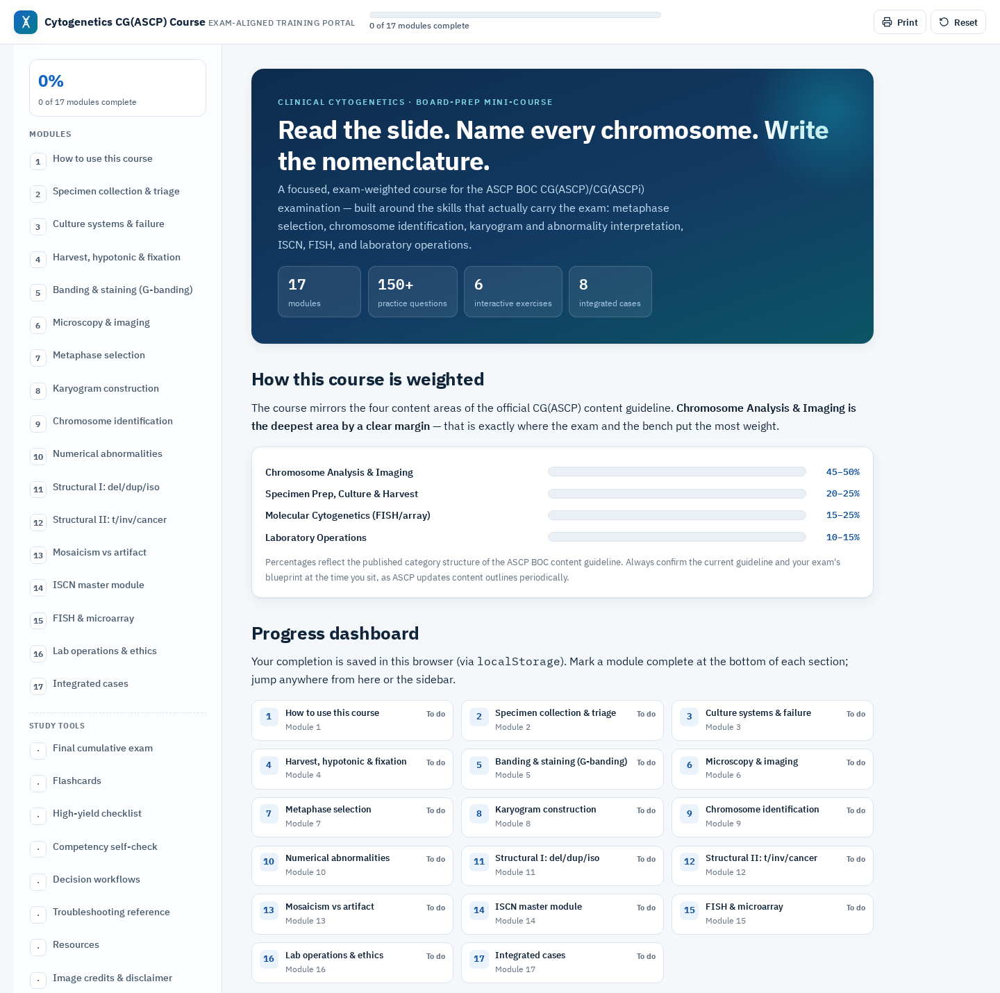

# Cytogenetics CG(ASCP) Study Course

[](https://github.com/jaustinanderson/cytogenetics-cg-course/actions/workflows/ci.yml)

An unofficial, browser-based cytogenetics study course built by a
CG(ASCP)-credentialed cytogenetic technologist. The project translates bench
experience into a portable educational application with structured content,
local progress tracking, performance analytics, and automated validation.

> **Status: beta baseline.** The application is functional and structurally
> validated. The full question bank has not yet completed a documented,
> question-by-question scientific review for public release.

See [Scientific Review Status](./docs/SCIENTIFIC_REVIEW.md) for the current,
itemized record of what has and has not been independently reviewed.

**[Open the live course](https://jaustinanderson.github.io/cytogenetics-cg-course/)**

[](./docs/assets/course-overview.png)

<sub>Click the screenshot to view it full-size. Regenerate it with `npm run capture:readme-screenshot` (see [Validation](./docs/VALIDATION.md)).</sub>

## Highlights

- 17 instructional modules
- 153 tagged practice questions
- 6 interactive exercise sets containing 30 items
- 61 flashcards across 7 decks
- 8 capstone cases plus 5 module-level cases
- Browser-local progress with v1-to-v2 migration
- Analytics by domain, topic, and difficulty
- Print-friendly course output
- A documented `window.CytoCourse` integration API
- A 19-entry image manifest with separate license and redistribution fields
- Self-hosted IBM Plex Sans/Mono webfonts and locally embedded approved images
  (no third-party font/image host requested at runtime)
- Automated structural and content-contract validation

## Run the course

Open [`index.html`](./index.html) in a modern browser. No installation, account,
or backend is required.

For local development, serve the repository over HTTP:

```bash
python3 -m http.server 8000
```

Then open `http://localhost:8000`.

The live GitHub Pages deployment serves the canonical root-level `index.html`.

## Course coverage

Five orientation questions are excluded from blueprint calculations. The
remaining 148 questions currently compare with the September 25, 2025 ASCP BOC
content guideline as follows:

| Domain | Questions | Current share | Guideline range | Status |
| --- | ---: | ---: | ---: | --- |
| Specimen preparation, culture, and harvest | 33 | 22.3% | 20–25% | Within range |
| Chromosome analysis and imaging | 91 | 61.5% | 45–50% | Overrepresented |
| Molecular cytogenetic testing | 14 | 9.5% | 15–25% | Underrepresented |
| Laboratory operations | 10 | 6.8% | 10–15% | Underrepresented |

The planned rebalancing adds 46 reviewed questions: 10 specimen, 23 molecular,
and 13 laboratory-operations questions. Expansion is intentionally gated behind
the content-governance and data-contract work in the
[roadmap](./docs/ROADMAP.md).

Official reference:
[ASCP BOC CG(ASCP) and CG(ASCPi) Examination Content Guideline](https://www.ascp.org/boc/docs/default-source/explore-credentials/content-guidelines/ascp_ascpi_cg_content_guideline.pdf)
(revised September 25, 2025).

## How progress works

The application is client-only:

- `cyto_cg_progress_v2` stores module completion and the last recorded outcome
  for each question and exercise.
- Existing `cyto_cg_progress_v1` module-completion data migrates on first load.
- Reset clears both current and legacy progress so migrated data cannot
  reappear.
- Export and import are exposed through the public API.
- There is no course account, telemetry system, or progress server.

Progress and answer history are not transmitted. As of 2026-07-31, the IBM
Plex Sans/Mono webfonts and the two approved public-domain images are
committed to this repository (`assets/fonts/`, `assets/images/`) and served
from the page's own origin — the page no longer requests any third-party
font or image host at runtime. Only the figures' source-page/credit links
(Wikimedia Commons, the CDC Public Health Image Library) remain external,
click-through references, which send no request until a visitor follows them.
See [Third-party notices](./THIRD_PARTY_NOTICES.md) for exact upstream
sources, retrieval dates, licenses, and file hashes.

## Integration API

The page exposes `window.CytoCourse` for inspection and controlled integration:

```js
CytoCourse.getModules();
CytoCourse.getQuestions();
CytoCourse.getStats();
CytoCourse.getWeakAreas(3);
CytoCourse.getUnmastered();
CytoCourse.exportJSON();
```

Validated runtime injection is available for an existing quiz:

```js
CytoCourse.addQuestions("m15", [
  {
    id: "m15-example-1",
    d: "molecular",
    t: "fish",
    x: 2,
    q: "Question prompt",
    o: ["Option A", "Option B"],
    a: 0,
    why: "Answer rationale"
  }
]);
```

Incoming batches are atomic: malformed questions, invalid answer indexes,
unknown domains, or globally duplicate IDs reject the entire batch. Runtime
injection is session-only unless external tooling exports and preserves the
result.

Current analytics describe **last-attempt mastery**, not total-attempt accuracy.
That distinction is intentional documentation of the present implementation,
not a claim that it is the final metric design.

## Architecture

The shipped product is intentionally a single, portable HTML document:

- semantic HTML
- custom CSS
- vanilla JavaScript
- browser `localStorage`
- no framework
- no production JavaScript package dependency
- no backend

Repository tooling is separate from the runtime application. Node.js is used
only to validate the course in development and CI. See
[Architecture](./docs/ARCHITECTURE.md) for the design rationale and
reconsideration triggers.

## Validation

Run:

```bash
npm test
```

The committed test suite checks:

- document and embedded-script structure
- absence of the development-only Tailwind CDN
- unique static DOM IDs
- explicit button types
- HTTPS external resources
- module and content counts
- complete question schemas and globally unique IDs
- answer-index bounds
- blueprint and difficulty distributions
- exercise, flashcard, and image-manifest counts
- embedded-image license and redistribution metadata
- atomic rejection of malformed or duplicate injected questions
- DOM-level navigation, quiz, exercise, migration, persistence, Reset,
  import/export, print, public API, event, and analytics behavior
- implemented keyboard and accessibility affordances that can be evaluated
  without layout or assistive technology
- the deployed-revision verifier's hashing/fetch logic, entirely over
  loopback (a local HTTP server standing in for "the live URL"), so it needs
  no external network access

A separate real-browser suite runs in Chromium via Playwright:

```bash
npm run test:e2e:install   # one-time browser download
npm run test:e2e
```

It exercises page initialization, navigation and mobile-sidebar behavior,
correct/incorrect quiz interaction, exercise interaction, module-completion
persistence across a real reload, v1-to-v2 migration, Reset clearing both
storage keys, import/export, the public API and its events, print invocation,
and page-origin console cleanliness, at both a desktop and a narrow/mobile
viewport. Playwright is a development-only dependency; the shipped course
has no runtime dependency on it.

The same Playwright run also includes automated WCAG scanning
(`@axe-core/playwright`, `tests/e2e/accessibility.spec.mjs`) against the fully
rendered course at both viewports and in several interaction states, and a
representative keyboard-only interaction suite
(`tests/e2e/keyboard-navigation.spec.mjs`) covering the visible sidebar nav,
the mobile menu, quizzes, exercises, module completion, Print, and Reset.
For each, the suite proves real Tab-order reachability by driving actual
`Tab` key presses to the target (never programmatic `.focus()`, which would
pass even on a control a keyboard user could never reach), asserts its
computed accessible name, confirms a genuinely visible focus outline
(non-`none` style, non-zero width, non-transparent color), and only then
activates it with `Enter`/`Space`, plus checks the absence of a keyboard
trap for the mobile menu. Automated scanning and keyboard testing are not a
screen-reader review; a genuine review with
real assistive technology has not been performed. See
[Validation](./docs/VALIDATION.md) for scope and limits.

A third, separate Playwright suite runs against the real deployed HTTPS
GitHub Pages URL rather than a local server:

```bash
npm run test:deployed   # defaults to https://jaustinanderson.github.io/cytogenetics-cg-course/
```

It confirms a successful HTTPS response, the expected title/heading, the 17
quiz mounts / 17 modules / 6 exercise sets, page-origin console cleanliness,
absence of horizontal overflow at the narrow viewport, mobile-navigation
open/close/backdrop/module-link behavior driven by Playwright's
touch-emulated `.tap()` (with `aria-expanded` checked against the sidebar's
actual on-canvas position, not just its class name), a touch-emulated quiz
interaction, reload persistence in an isolated browser context, and the
actual decoded natural dimensions of the two approved images, now served
locally from this deployment's own origin rather than a third-party image
host. The target URL is configurable via `DEPLOYED_BASE_URL`. This suite is
separate from `npm test` and `npm run test:e2e` on purpose — it requires
outbound internet access and must never make an ordinary local or PR run
depend on it. `scripts/verify-deployed-revision.mjs` guards against testing a
stale deployment by combining two checks — GitHub's own deployments API
record for the target commit, and a cache-busted SHA-256 comparison of the
live `index.html` against the checked-out one — instead of assuming a fixed
wait was long enough. Each check proves something narrower than "this is
definitely the currently served commit" on its own; see
[Validation](./docs/VALIDATION.md) for the precise scope of each, the exact
image-delivery result observed, and the distinction between touch
*emulation* and physical touch hardware.

Passing these tests does **not** establish scientific correctness. Scientific
review, rights review, a representative screen-reader review, and release
readiness are separate gates documented in
[Validation](./docs/VALIDATION.md). True touch-gesture testing on physical
hardware also remains open — Playwright's `hasTouch`/`.tap()` emulates touch
input, it does not exercise real touch hardware or a mobile OS/browser.

## Repository map

```text
.
├── index.html                    # Canonical distributable course
├── README.md
├── CHANGELOG.md
├── CONTRIBUTING.md
├── THIRD_PARTY_NOTICES.md
├── CLAUDE.md                     # Collaboration guardrails
├── package.json
├── playwright.config.mjs         # Real-browser (Chromium) smoke-test config
├── playwright.deployed.config.mjs # Deployed HTTPS Pages smoke-test config
├── assets/
│   ├── images/                   # Locally embedded, approved public-domain course images
│   └── fonts/                    # Self-hosted IBM Plex Sans/Mono webfonts (SIL OFL 1.1)
├── scripts/
│   ├── verify-deployed-revision.mjs # Deployment-record + live-hash check before testing
│   └── capture-readme-screenshot.mjs # Regenerates docs/assets/course-overview.png
├── tests/
│   ├── validate-course.mjs       # Structural/content contracts
│   ├── dom-behavior.mjs          # Dependency-free behavior checks
│   ├── dom-harness.mjs           # Minimal test-only DOM fixture
│   ├── verify-deployed-revision.mjs # Loopback-only hash-check tests (no external network)
│   ├── e2e/                      # Playwright real-browser smoke suite (local server)
│   └── e2e-deployed/             # Playwright smoke suite (real deployed Pages URL)
├── docs/
│   ├── ROADMAP.md
│   ├── ARCHITECTURE.md
│   ├── CONTENT_GOVERNANCE.md
│   ├── VALIDATION.md
│   ├── QUALITY_LOG.md
│   ├── LICENSING.md
│   ├── SCIENTIFIC_REVIEW.md      # Current scientific-review status record
│   ├── CLAUDE_HANDOFF.md
│   ├── assets/
│   │   └── course-overview.png   # README screenshot (regenerate via the script above)
│   └── archive/
│       └── claude-roadmap-v1.md
└── .github/
    └── workflows/
        ├── ci.yml
        └── deployed-smoke.yml    # Manual/post-deploy deployed-site verification
```

## Contributing

Factual corrections are especially welcome, but they require an authoritative
source and a clear explanation. See [CONTRIBUTING.md](./CONTRIBUTING.md) and
[Content governance](./docs/CONTENT_GOVERNANCE.md).

## Content and privacy boundaries

This repository must not contain:

- protected health information or accession numbers
- employer-confidential material or proprietary SOPs
- recalled certification-examination questions
- unlicensed or redistribution-uncertain media
- AI-generated scientific content represented as expert-reviewed

## Disclaimer

This is an independent educational study aid. It is not clinical guidance and
is not affiliated with, endorsed by, or sponsored by ASCP or the ASCP Board of
Certification. ASCP and credential designations are referenced only to describe
exam alignment. Use the current ISCN edition, current authoritative guidance,
and locally validated procedures for real laboratory work.

## Licensing

No repository-wide license has been selected yet. Software, original
educational content, original diagrams, and third-party media require separate
licensing decisions. See [Licensing](./docs/LICENSING.md) and
[third-party notices](./THIRD_PARTY_NOTICES.md).

## Author

[Jerad Austin Anderson](https://github.com/jaustinanderson), CG(ASCP) — a
cytogenetic technologist building evidence-first clinical laboratory,
informatics, and AI-engineering projects.
